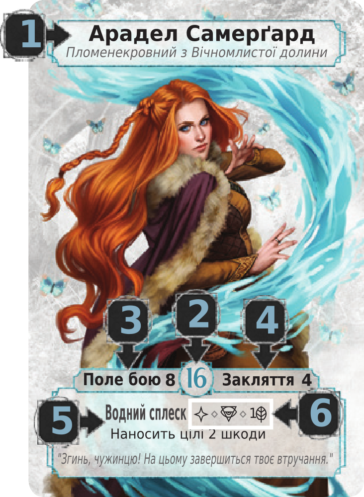
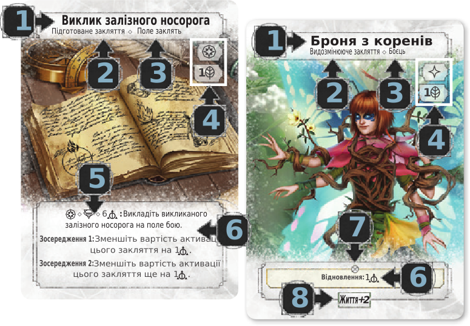
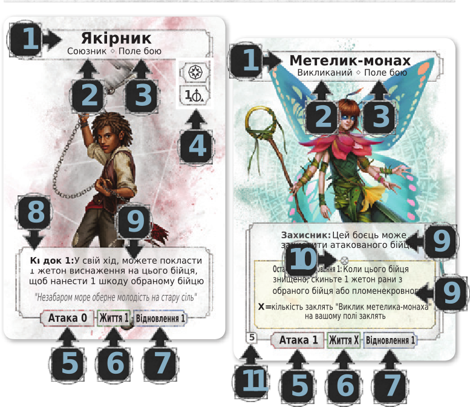

# Ashes: Відродження Пломенекровних

The Red Rains swept over the world of Argaia, poisoning the creatures that dwelt there, and from these rains the chimera were born. Some say the chimera were a curse upon humanity for their crimes against the children of dragons, but whatever the reason for their birth, the chimera visited destruction upon the world, and civilization shuddered. These monstrous foes slaughtered armies, devoured townships, and despoiled the ground and seas. Humans withdrew to the largest of cities, and these they fortified against the horrors of the world outside.

Ages passed and humanity's future looked bleak. But then a new power arose to confront the chimera. They were called the Phoenixborn - humans capable of wielding magics not previously thought possible, and together they initiated the Great Cleansing, and eradicated the chimera menace. The great cities finally reopened, trade flourished, and the Phoenixborn ushered humanity into a new golden age.

But the mysterious source which the Phoenixborn drew upon was not done with them. Each of these wizard-warriors had been gifted with but a fraction of the true power that blessed them, and that power now desired unification. Slowly but steadily, the Phoenixborn were plagued with a desire to slaughter their own kind, and absorb the abilities of their incinerated kin. Now is the time of the Collection of Ashes, when Phoenixborn must battle Phoenixborn until only one remains to inherit a newborn world.

## Мета гри

У Ashes, ви - пломенекровний, повелитель магії, який бореться з іншими пломенекровними в двобої розуму і магічної досконалості. Чаклуйте закляття, викликайте союзників щоб знищити ваших суперників і перемогти.

## Компоненти в цьому наборі

* 6 – карти пломенекровних
* 241 – карти бійців/заклять
* 4 – карти-пам'ятки фаз гри
* 16 – карти-пам'ятки властивостей кісток
* 26 – жетони ран
* 30 – жетони виснаження
* 21 – жетони стану
* 10 – кістки зачарування
* 10 – кістки ритуалу
* 10 – кістки омани
* 10 – кістки природи
* 1 – жетон першого гравця
* 1 – правила гри

## Пломенекровний

1. Ім'я
2. Значення життя
3. Ліміт поля бою
4. Ліміт поля заклять
5. Здібність
6. Вартість активації

## Карти заклять

1. Назва
2. Тип
3. Місце викладання
4. Вартість грання
5. Вартість активації
6. Ефект
7. Необмежений ефект
8. Значення бонусу

## Карти бійців

1. Назва
2. Тип
3. Місце викладання
4. Вартість грання
5. Значення атаки
6. Значення життя
7. Значення відновлення
8. Вартість активації
9. Здібність
10. Необмежений ефект
11. Ліміт виклику

