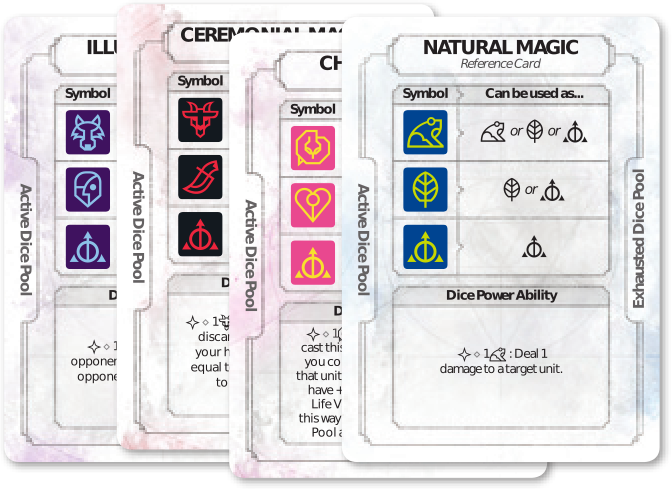

# Ashes: Відродження Пломенекровних

Червоні дощі прокотились Арґаєю, отруюючи створінь що населяли світ. Під цим дощем у світі народилась химера. Кажуть, що химера стала прокляттям людства за злодіяння проти дітей драконів. Але якою б не була справжня причина її народження, химера сколихнула цивілізацію, перетворюючи світ на руїни. Цей страхітлививй ворог винищував армії, трощив селеща і псував землі та моря. Люди втікали до великих міст, де відгороджувались від жахів, що коїлись у світі.

The Red Rains swept over the world of Argaia, poisoning the creatures that dwelt there, and from these rains the chimera were born. Some say the chimera were a curse upon humanity for their crimes against the children of dragons, but whatever the reason for their birth, the chimera visited destruction upon the world, and civilization shuddered. These monstrous foes slaughtered armies, devoured townships, and despoiled the ground and seas. Humans withdrew to the largest of cities, and these they fortified against the horrors of the world outside.

І коли, за декілька віків майбутнє людства майже згасло, з'явилась нова сила, що здатна була протистояти химері. Їх назвали пломенекровними - людьми, які оволоділи незнаною до того магією. Разом вони влаштували «Велике Очищення» і знищили загрозу химери. Величні міста нарешті знову відкрились, торгівля процвітала, і пломенекровні привели людство до нової золотої доби.

Ages passed and humanity's future looked bleak. But then a new power arose to confront the chimera. They were called the Phoenixborn - humans capable of wielding magics not previously thought possible, and together they initiated the Great Cleansing, and eradicated the chimera menace. The great cities finally reopened, trade flourished, and the Phoenixborn ushered humanity into a new golden age.

Але містичне джерело магічних сил пломенекровних ще не взяло своє. Кожен з чаклунів-воїнів був обдарований лише частинкою справжньої сили і ця сила прагнула до возєднання.

But the mysterious source which the Phoenixborn drew upon was not done with them. Each of these wizard-warriors had been gifted with but a fraction of the true power that blessed them, and that power now desired unification. Slowly but steadily, the Phoenixborn were plagued with a desire to slaughter their own kind, and absorb the abilities of their incinerated kin. Now is the time of the Collection of Ashes, when Phoenixborn must battle Phoenixborn until only one remains to inherit a newborn world.

## Мета гри

У Ashes, ви - пломенекровний, повелитель магії, який бореться з іншими пломенекровними в двобої розуму і магічної досконалості. Чаклуйте закляття, викликайте союзників щоб знищити ваших суперників і перемогти.

## Компоненти в цьому наборі

* 6 – карти пломенекровних
* 241 – карти бійців/заклять
* 4 – карти-пам'ятки фаз гри
* 16 – карти-пам'ятки властивостей кубиків
* 26 – жетони ран
* 30 – жетони виснаження
* 21 – жетони стану
* 10 – кубики зачарування
* 10 – кубики ритуалу
* 10 – кубики омани
* 10 – кубики природи
* 1 – жетон першого гравця
* 1 – правила гри

## Пломенекровний

1. Ім'я
2. Значення життя
3. Ліміт поля бою
4. Ліміт поля заклять
5. Здібність
6. Вартість активації

## Карти заклять

1. Назва
2. Тип
3. Місце викладання
4. Вартість грання
5. Вартість активації
6. Ефект
7. Необмежений ефект
8. Значення бонусу

## Карти бійців

1. Назва
2. Тип
3. Місце викладання
4. Вартість грання
5. Значення атаки
6. Значення життя
7. Значення відновлення
8. Вартість активації
9. Здібність
10. Необмежений ефект
11. Ліміт виклику

## Кубики

У Ashes є різні типи кубиків (4 типи в цьому наборі). Кожен тип має три різні символи, що зображені в таблиці нижче:

|                   |                        Символ сили                        |                       Символ класу                        |                      Базовий символ                       |
| :---------------: | :-------------------------------------------------------: | :-------------------------------------------------------: | :-------------------------------------------------------: |
|   Кубик природи   |    |    |    |
| Кубик зачарування |        |        |        |
|   Кубик ритуалу   |      |      |      |
|    Кубик омани    |  |  |  |

## Карти-пам'ятки властивостей кубиків

Кубики з символом сили можна використати як другорядну дію для активації його ефекту. Карти-пам'ятки описують ефект сили усіх типів кубиків.

## Жетони

|  |  |  |  |
| :--------------------------------------: | :------------------------------------------------: | :----------------------------------------: | :----------------------------------------------------: |
|                 **Ран**                  |                   **Виснаження**                   |                 **Стану**                  |                   **Першого гравця**                   |

## Приготування до гри

1. #TODO
2. Розмістіть вашого пломенекровного в ігровій зоні характеристикою горілиць.
3. Оберіть першу п'ятірку карт з колоди в руку. Карти в першій п'ятірці не повинні дублюватись.
4. Розмістіть ваш стос виклику долілиць в ігровій зоні.
5. Перемішайте решту карт з вашої колоди. Сформуйте з них стос добору і розмістіть його в ігровій зоні долілиць.
6. Візміть карти-пам'ятки властивостей кубиків відповідно до кубиків які ви використовуєте і, при потребі, карту-пам'ятку фаз гри.
7. Розмістіть 10 кубиків у використаному резерві.
8. Сформуйте 3 окремі купи жетонів.

---

1. Choose a deck to play with (see page 14-15 for suggested decks). Or build a deck to play with (see page 14 for deck building rules). Or draft a deck to play with (see page 16 for drafting rules).
2. Place your Phoenixborn in your play area with stats side face up.
3. Choose your First Five by taking 5 cards of your choosing from your deck and adding them to your hand. You may not include more than one copy of a card in your First Five.
4. Place your conjuration pile face down in your play area.
5. Shuffle the rest of your deck and form a face down draw pile in your play area.
6. Take the dice power reference cards that correspond to the dice you are using and a phases of play reference card, if needed.
7. Place all 10 of your dice in your exhausted pool.
8. Make 3 separate piles of tokens within reach of all players.

## Ігрова зона

Протягом гри в Ashes, ви будете розміщувати закляття на полі заклять і бійців на полі бою. Ось приклад, як може виглядати ваша ігрова зона в ході гри.

As a game of Ashes is played, you will place spells onto your spellboard and units onto your battlefield.  Here is an example of what your play area might look like during a game in progress.

1. Пломенекровний
2. Стос скиду гравця
3. Стос добору гравця
4. Карти-пам'ятки властивостей кубиків
5. Резерв активних кубиків
6. Резерв використаних кубиків
7. Поле бою
8. Поле заклять
9. Стос виклику

---

1. Phoenixborn
2. Player Discard Pile
3. Player Draw Pile
4. Dice PowerReference Cards
5. Active Dice Pool
6. Exhausted Dice Pool
7. Battlefield
8. Spellboard
9. Conjuration Pile

## Послідовнцість раунду

Гра Ashes триває кілька раундів. Кожен раунд складається з 3-х фаз, які потрібно виконати у вказаній послідовності.

Ashes is played over a series of rounds. Each round is divided into 3 phases that must be resolved in order.

1. Фаза підготовки
2. Фаза ходу гравців
3. Фаза відновлення

---

1. Prepare Phase
2. Player Turns Phase
3. Recovery Phase

### Фаза підготовки

During the prepare phase each player simultaneously resolves the following 3 steps in order.

1. Roll Dice: Roll all of the dice in your exhausted pool and place them in your active pool. On the first round of the game, the player who rolls the most basic symbols during this first roll receives the first player token. If there is a tie, those players must reroll until that tie is broken.
2. Discard Cards: You may discard any number of cards from your hand.
3. Draw Cards: Draw cards until you have 5 cards in your hand. If your draw pile is empty, your Phoenixborn receives 1 damage for each card that you should have drawn but could not.

> Note: A Phoenixborn does not receive damage if you must draw a card outside of the prepare phase and cannot.

### Фаза ходу гравців

During the player turns phase you and your opponents will alternate taking turns, starting with the player that has the first player token.  On your turn you must take 1 main action and may choose to take 1 side action. These may be taken in any order. The main actions available to you are:

* Pay a  cost: Some cards require a main action be taken to play or activate that card.
* Attack a Phoenixborn: Attack an opponent’s Phoenixborn with your units.  Your opponent may block with his units.
* Attack a Unit:  Attack an opponent’s unit with your units. Your opponent may guard with his Phoenixborn.
* Pass: If you cannot perform any other main action, or choose not to perform any other main action, you must pass as your main action.

The side actions available to you are:

* Pay a  cost: Some cards require a side action be taken to play or activate that card.
* Meditate: Discard cards to change the facings of your dice.
* Activate Dice Power Ability: Pay the activation cost of a Dice Power ability and carry out its effect.

After you have taken both a main action and side action (or have taken a main action and chosen not to take a side action) play passes clockwise to the next player.  Play continues to pass clockwise until all players have consecutively chosen pass as their main action.  When that happens, the player turns phase is over and players move on to the recovery phase.

### Фаза відновлення

During the recovery phase resolve the following 4 steps in order.

1. Recover: Remove a number of wound tokens from each unit in play up to that unit’s recover value.
2. Remove Exhaustion: Remove 1 exhaustion token from each card in play that has 1 or more exhaustion tokens on it.
3. Exhaust Dice: Each player may move any number of dice from her active pool to her exhausted pool.
4. Pass First Player Token: The player that has the first player token passes it to the player on her left.

After resolving these 4 steps the round is over. Begin a new round starting with the prepare phase.

## Main Actions

### Pay a Cost

If the symbol appears on a play cost or activation cost, part of the cost to play or activate that card is that it takes up your main action for the turn (see page 10 for details on playing cards and paying costs).

### Attack a Phoenixborn

Attack a target Phoenixborn with 1 or more of your units.  When you attack a Phoenixborn, resolve the following steps in order (see ‘Example: Attacking a Phoenixborn’ on page 7):

1. Declare Attackers: You (the attacking player) choose any number of your unexhausted units to attack with by pushing them forward on your battlefield.
2. Choose Target: Choose an opponent’s Phoenixborn to attack. All of your attacking units will attack this targeted Phoenixborn.
3. Declare Blockers: The defending player may declare up to 1 blocker for each attacking unit.  To declare a blocker, the defending player places 1 of her unexhausted units in front of an attacking unit to show that her unit is blocking that attacker.  Each attacking unit cannot be blocked by more than 1 unit.
4. Resolve Damage: One at a time, in an order of your choosing, resolve each attacking unit’s damage. If the attacking unit is unblocked, deal an amount of damage equal to its attack value on the defending player’s Phoenixborn. Then place 1 exhaustion token on the attacking unit.  If the attacking unit is blocked, the defending player may now choose to counter with his blocking unit.
    1. If the defending player chooses not to counter with his blocking unit, the attacking unit will deal damage equal to its attack value to the blocking unit. Then place 1 exhaustion token on the attacking unit. The blocking unit does not become exhausted if it did not counter.
    2. If the blocking unit counters, both units are now considered to be in battle. Units in battle will simultaneously deal an amount of damage equal to their attack values on each other. Then place 1 exhaustion token on each unit involved in that battle that was not destroyed.

### Attack a Unit

Attack a target unit with 1 or more of your units.  When you attack a unit, resolve the following steps in order (see ‘Example: Attacking a Unit’ on page 8):

1. Declare Attackers: Declare which of your units are attacking by pushing them forward on the battlefield.
2. Choose Target: Choose a single unit to target on an opponent’s battlefield. All of your attacking units will attack the targeted unit.
3. Declare a Guard: The defending player may choose to have her Phoenixborn guard the unit being targeted by moving her Phoenixborn in front of that unit.  The Phoenixborn is now the target of the attack. **Note**: *A Phoenixborn can guard even if it is exhausted.* An unexhausted unit the defending player controls with the ‘Unit Guard’ ability can be declared as a guard in the same way. Only a single unit can be declared as a guard for any given attack.
4. Resolve Damage: If the final target of the attack is a Phoenixborn, total each attacking unit’s attack values and deal that amount of damage to the target Phoenixborn. Then place 1 exhaustion token on each attacking unit. If the final target of the attack is a unit and that unit is unexhausted the defending player may now choose to counter with that unit.
   1. If the target unit does not counter or cannot counterbecause it is exhausted, total each of the attacking unit’s attack values and deal that amount of damage on the target unit. Then place 1 exhaustion token on each attacking unit. The target unit does not get an exhaustion token if it did not counter.
   2. If the target unit counters, the attacking player’s units and the defending player’s unit are now considered to be in battle. Total each of the attacking unit’s attack values and deal that amount of damage on the defending player’s unit. Simultaneously the defending player’s countering unit will deal an amount of damage equal to its attack value to the attacking units. If the defending player is countering multiple units, the defending player may choose how to split up her unit’s damage among the attacking units. Then place 1 exhaustion token on each unit involved in that battle that was not destroyed.

### Pass

If you cannot take any other main action, you must choose to pass as your main action. You may also choose to pass even if there are other main actions you could perform.   When you pass, your main action is to do nothing.  If all players pass on consecutive turns, the player turns phase ends and players move on to the recovery phase of the round.

> **Note:** *If a player passes and 1 or more of her opponents do not, the player turns phase continues and the player who passed may pass again or take any other main action (if able) on her next turn.*

## Словник термінів

**Здібність:** ефект який мають пломенекровні або бійці у грі. Здібності є постійними або такими, які потрібно активувати.

Ability: An effect that a Phoenixborn or Unit has on the game that in some cases is constant and in other cases needs to be activated.

**Миттєве закляття:** тип карт заклять які мають одноразовий ефект.

Action Spell: A type of spell card that is played for a 1 time effect.

**Вартість активації:** вартість, яку необхідно сплатити щоб активувати закляття або здібність.

Activation Cost: The cost that needs to be paid to activate a spell or ability (cause its effect to happen).

**Резерв активних кубиків(або активний резерв):** місце де ви розміщуєте кубики на початку кожного раунду.

Active Dice Pool (aka Active Pool): The place where you place your dice at the beginning of each round.

**Активний кубик:** кубик який знаходиться у активний резерві і може бути витрачений щоб сплатити відповідну вартість.

Active Dice: Dice that are currently in your active pool and can be spent to pay a matching magic cost.

**Союзник:** тип карти бійця.

Ally: A type of unit card.

**Видозмінююче закляття:** тип карт заклять які можуть бути додані до  бійця на полі бою щоб певним чином його модифікувати.

Alteration Spell: A type of spell card that can be attached to a unit on a player’s battlefield to alter that unit in some way.

**Додавання:** процес розміщення видозмінюючого закляття під бійцем і застосування його ефекту і бонусного значення до цього бійця.  

Attach: The process of placing an alteration spell underneath a unit and applying its effects and value bonuses to that unit.

**Додана карта:** карта, яку було додано до бійця.

Attached Card: A card that has been attached to a unit.

**Атакуючий:** невиснажений боєць, якого оголошено атакуючим у основній дії «Напад на пломенекровного» або «Напад на бійця».

Attacker: An unexhausted unit that has been declared to be attacking when performing the ‘Attack a Phoenixborn’ or ‘Attack a Unit’ main action.

**Значення атаки:** кількість шкоди яку завдає боєць під час атаки

Attack Value: The amount of damage that a unit deals
when attacking.

**Поле бою:** частина вашої ігрової зони де ви розміщуєте бійців.

Battlefield: The part of your play area where units are
placed.

**Ліміт поля бою:** кількість бійців, яку прломенекровний може розмістити на полі бою.

Battlefield Value: The number of units a Phoenixborn can have on its battlefield.

**Блокуючий:** невиснажений боєць, якого оголошено блокуючим для 1-го атакуючого бійця.

Blocker: An unexhausted unit that has been declared to be blocking 1 attacking unit.

**Скасувати:** ефект який перериває виконання закляття, здібності або властивість кубика. Коли закляття, здібність або властивість кубика скасовано, гравець все ще повнен сплатити їх вартість, але не може застосувати їх ефект.

Cancel: An effect that prevents another spell, ability, or
dice power from resolving. When a spell, ability, or die
power is canceled, the costs are still paid by the player
that used it, but the canceled effects are not resolved.

**Викликаний:** тип карти бійця, які на початку гри знаходяться в стосі виклику і можуть бути зіграні лише активацією ефекту карти.

Conjuration: A type of unit card that starts the game
in a conjuration pile and can be brought into play by a
card effect.

**Ліміт виклику:** Кількість копій карт викликаних бійців, яку можна підмішати в стос виклику.

Conjuration Limit: The number of copies of a
conjuration unit card you are allowed to put into your
conjuration pile.

**Стос виклику:** стос карток викликаних бійців яких можна зіграти.

Conjuration Pile: A stack of conjuration cards that
contains the conjuration units that your deck is capable
of producing.

**Контролювати:** гравець контролює картку, якщо вона на його полі бою або полі заклять, або це пломенекровний гравця. Гравець також контролює карти які додані до його карт.

Control: A card is controlled by a player if it is on a
player’s battlefield or spellboard or is that player’s
Phoenixborn. A player also controls any card that is
attached to a card she controls.

**Колода:** кожен з гравців мусить збудувати або обрати готову колоду для гри в Ashes. Колода складається з 1-го пломенекровного, 10-ти кубиків і 30-ти карт.

Deck: Each player must build a deck or select a
pre-built deck to play Ashes. A deck consists of 1
Phoenixborn, 10 dice and 30 cards.

**Гравець, що захищається:** гравець чий пломенекровний або боєць був оголошений ціллю дії «Напад на пломенекровного» або magic cost.

Defending Player: A player whose Phoenixborn or unit
has been declared the target of an ‘Attack a Unit’ or
‘Attack a Phoenixborn’ action.

**Резерв кубиків:** збірка з 10-ти кубиків, які є частиною колоди гравця.

Dice Pool: A collection of 10 dice that is a part of a
player’s deck.

**Властивість кубика:** кожен тип кубика має особливу властивість, яку можна активувати витративши другорядну дію і кубик з символом властивості.

Dice Power: Each dice type has a unique ability that can
be performed by spending a side action and a die of
that type that is power symbol side up.

**Стос скиду:** місце в ігровій зоні де ви розміщуєте скинуті карти. Карти потрібно скидати горілиць.

Discard Pile: The place in the play area where you
place cards that you are instructed to discard. Cards are
placed in the discard pile face up.

**Стос добору:** стос карт які ви добираєте протягом гри.

Draw Pile: The pile of cards that you draw from during
the game.

**Ефект:** правила, що пояснюють як закляття або здібності взаємодіють з грою.

Effect: Rules for how a spell or ability interacts with the
game.

**Виснаження (карта):** процес викладання жетону виснаження на карту.

Exhaust (when referring to a card): The process of
placing an exhaustion token on a card.

**Використанння (кубик):** процес переміщення кубика в ваш використаний резерв внаслідок ефекту карти або сплати вартості.

Exhaust (when referring to a die): The process of
placing a die in your exhausted pool because of the
result of a card effect or paying a cost.

**Виснажена (карта):** карта на яку викладено жетон виснаження. Виснажена карта не може активувати здібність, а також атакувати і блокувати.

Exhausted (when referring to a card): A card that has
an exhaustion token on it is exhausted. Cards that are
exhausted have no ability text and cannot attack or
block.

**Використаний (кубик):** кубик який знаходиться в вашому використаному резерві.

Exhausted (when referring to a die): A die that is
currently in your exhausted dice pool is considered
exhausted.

**Резерв використаних кубиків (використаний резерв):** місце де ви розміщуєте кубики використані для сплати вартості.

Exhausted Dice Pool (aka Exhausted Pool): The place
where you place your dice when they are spent to pay a
magic cost.

**Використаний кубик:** кубик який знаходиться в вашому використаному резерві і не може бути витрачений для сплати вартості.

Exhausted Dice: Dice that are currently in your
exhausted dice pool and cannot be spent to pay a
magic cost.

**Жетон виснаження:** жетон, який викладається на карту і позначає її як виснажену.

Exhaustion Token: A token that when placed on a card
marks that card as being exhausted.

**Перша п'ятірка:** 5 різних обраних карт, що формують вашу початкову руку

First Five: A selection of 5 different cards that form
your starting hand.

**Захисник:** пломенекровний або боєць зі здібністю «Захисник», який був оголошений захисником бійця атакованого основною дією «Напад на бійця».

Guard: A Phoenixborn or unit with the ‘Unit Guard’
ability that has been declared to be guarding a unit
that is being targeted for an attack by an ‘Attack a Unit’
main action.

**У грі:** карта у грі, якщо її контролює будь-який гравець(катри на полі бою або полі заклять, пломенекровний гравця, карти додані до карт у грі). Якщо на карті або в правилах не вказано інакше, карта мусить бути у грі, щоб її текст став доступний для використання.

In Play: A card is in play if it is controlled by any player,
(i.e. on a player’s battlefield or spellboard, is a player’s
Phoenixborn, or is attached to a card that is in play).
Unless explicitly stated on the card or explicitly allowed
by the game rules, a card must be in play for that card’s
text to be used.

**Необмежений ефект:** Ефект, який можна використовувати навіть якщо карта виснажена.

Inexhaustible Effect: Effects that remain even if a card
is exhausted.

**Значення життя:** ліміт жетонів ран, який можна викласти на пломенекровного або бійця до його знищення.

Life Value: The number of wound tokens that a
Phoenixborn or unit can have placed on it before it is
destroyed.

**Власник:** гравець є власником карт з колод добору і виклику, з якими він починає гру.

Owner: A card’s owner is the player whose deck or
conjuration pile that card started the game in.

**Пломенекровний:** кожен гравець контролює пломенекровного. Якщо вашого пломенекровного знищують - ви програєте гру.

Phoenixborn: Each player controls a Phoenixborn.
When your Phoenixborn is destroyed, you lose the game.

**Розміщення:** місце куди викладають зіграну карту. Приклади: поле бою, боєць, скид, поле заклять.

Placement: Direction on where a card goes when it is
played. Examples: Battlefield, Unit, Discard, Spellboard.

**Вартість грання:** вартість яку необхідно сплатити щоб зіграти карту.

Play Cost: The cost that needs to be paid before a card
can be put into play.

**Протидіюче закляття:** тип карт заклять які мають одноразовий ефект і можуть бути зіграні при виконанні певних умов. Кожен гравець може зіграти протидіюче закляття раз за хід.

Reaction Spell: A type of spell card that can only be
played if a specific condition is met for a 1 time effect.
Each player may only play 1 reaction spell per turn.

**Підготоване закляття:** тип заклять які викладають на поле заклять до кінця гри. Щоб застосувати ефект підготованого закляття у грі потрібно сплатити вартість активації.

Ready Spell: A type of spell that is placed on your
spellboard and remains in play. Usually there is a cost
to activate the spell once it is in play.

**Значення відновлення:** Кількість жетонів ран які потрібно скинути з бійця під час кроку відновлення у фазу відновлення.

Recover Value: The number of wound tokens that are
removed from a unit during the recover step of the
recovery phase.

**Закляття:** будь-яка карта що має у назві типу слово «закляття». Приклад: підготоване закляття.

Spell: Any card that has the word ‘spell’ as a part of its
card type. Example: Ready Spell

**Поле заклять:** місце в ігровій зоні де ви викладаєте підготовані закляття.

Spellboard: The part of your play area where ready
spells are placed.

**Ліміт поля заклять:** максимальна кількість різних підготованих заклять на полі заклять пломенекровного.

Spellboard Value: The number of different ready spells
a Phoenixborn can have on their spellboard.

**Характеристики:** значення представлені на картах пломенекровних і бійців

Stats: The values displayed on Phoenixborn and unit
cards.

**Ціль:** термін який визначає що ефект закляття, здібність або властивість кубика напряму впливає на щось, наприклад видозміну, бійця, гравця, пломенекровного тощо.

Target: A term that is used to identify that the effect
of a spell, ability or die power is directly affecting
something (including, but not limited to, an alteration, a
unit, a player, or a Phoenixborn).

**Тип:** кожне закляття і кожен боєць мають тип. Приклад: союзник, викликаний, підготоване закляття, видозмінююче закляття, миттєве закляття, протидіюче закляття.

Type: Each spell and unit card has a type. Examples: Ally,
Conjuration, Ready Spell, Alteration Spell, Action Spell,
Reaction Spell.

**Невиснажений:** карта, на якій відсутні жетони виснаження.

Unexhausted: A card that does not have an exhaustion
token on it.

**Боєць:** карта типу союзник або викликаний, що викладається на поле бою і залишається там до знищення.

Unit: A card with the type ally or conjuration that is
played on a player’s battlefield and remains in play until
it is destroyed.

**Значення бонусу:** число на яке збільшується або зменшується значення атаки, життя або відновлення бійця до якого додано видозмінююче закляття.

Value Bonus: The amount an alteration spell increases
or decreases the attack, life, or recovery value of the
unit it is attached to.

**Жетон рани:** жетон, який викладають на свого бійця або пломенекровного щоб відслідковувати, наскільки вони близькі до знищення.

Wound Token: Tokens that you place on your units
and Phoenixborn to track how close they are to being
destroyed.
